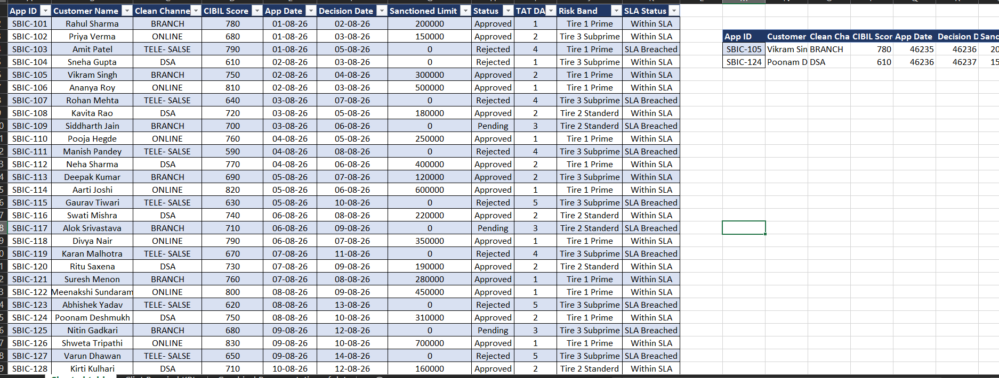

# Banking Credit Application MIS & TAT Tracking Dashboard

## Project Overview
An operational MIS dashboard built to track loan and credit application workflows, monitor Turnaround Time (TAT) compliance, and analyze approval vs. rejection rates across application channels.

## 1. Raw Data & Processed Table

## 2. Pivot Table KPIs & Metrics

## 3. Graphical Representation & Visual Dashboard

## Key Business Metrics & Features
- **Turnaround Time (TAT) Analysis:** Calculated processing duration across approval stages to identify operational bottlenecks.
- **Application Status Tracking:** Visual breakdown of Approved, Pending, and Rejected applications.
- **Dynamic Excel Formulas:** Built using `INDEX/MATCH`, `SUMIFS`, conditional logic, and custom KPI cards.

## Key Business Insights
1. **TAT Optimization:** Identified processing delays occurring primarily during document verification stages.
2. **Channel Performance:** Direct sales channels showed higher approval rates compared to third-party agency leads.

## How to View
1. Open the preview images above for a step-by-step look at the data structure and visuals.
2. Download `MY First Project on excel.xlsx` to test interactive dynamic features.
